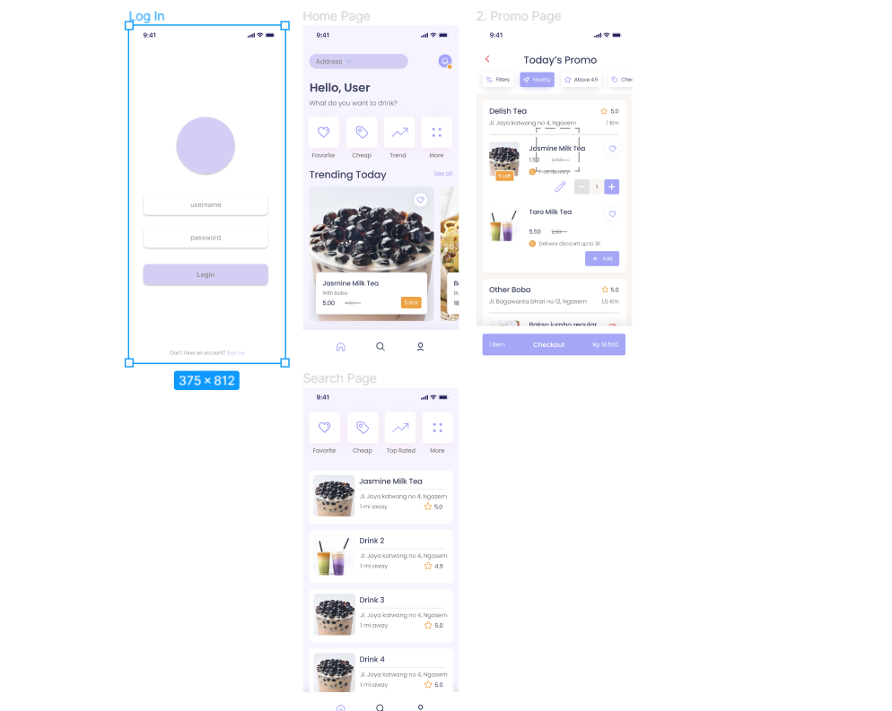

# Boba Rating App
Original App Design Project - README Template
===

# Boba Rating App

## Table of Contents
1. [Overview](#Overview)This is going to be a fun and interactive app. The user will be shown list of drinks offered and ratings associated to it. The user can login to app and rate the drinks..
2. [Product Spec](#Product-Spec) 
3. [Wireframes](#Wireframes)
4. [Schema](#Schema)

## Overview
This is going to be a fun and interactive app. The user will be shown list of drinks offered and ratings associated to it. The user can login to app and rate the drinks.
### Description
Going to keep two login profiles one for Quiz creator and one for quiz player. Going to user back4app for backend and creator can create a quiz and player can select quiz and play them.

### App Evaluation
[Evaluation of your app across the following attributes]
- **Category:** Checkout and Rating (Sell)
- **Mobile:** Using Camera, Audio and user profiles are saved.
- **Story:** I think rating the drinks will be interesting and will attract users
- **Market:** As I said earlier we can create different types of drink ratings and attract customers
- **Habit:** If we update quizes drinks offered regularly there will be growth. As people drink bearages atleast once per day
- **Scope:** Hopefully we can complete this app by the end of this program. But this a big app so will try to complete required stories

## Product Spec

### 1. User Stories (Required and Optional)

Required Must-have Stories

-[*]* User login page and login api.
-[*]* User can rate a drink selected
-[*]*User get to see a dashboard with trending today items.
-[*]* Maintain the user ratings for drinks.
-[*]* User data should be persisted in Parse.
-[ ] Adding filters for cheap, favourite and top rated for drinks.
-[ ] Logout securely and maintain user profile

**Optional Nice-to-have Stories**
-[] Login by Facebook
-[] Profile photo of user
-[] Try audio type for product description

### 2. Screen Archetypes
* Login
* Signup
* Homepage
* Promo Page
* Search Page

### 3. Navigation

**Tab Navigation** 

Search
Profile
Home

**Flow Navigation** (Screen to Screen)

Log-in -> Account creation if no log in is available
Drink Selection -> Jumps to promo page
Search drink
Promopage and checkout

## Wireframes
[Add picture of your hand sketched wireframes in this section]

### [BONUS] Digital Wireframes & Mockups

### [BONUS] Interactive Prototype

## Schema 
## Model

   | Property      | Type     | Description |
   | ------------- | -------- | ------------|
   | objectId      | String   | unique id for the each drink |
   | description       | String| about drink |
   | image         | File     | image of drink|
   | rating | Number   | rating of each drink |
   | ratingdisplay    | Number   | sum of ratings |
   

### Networking
    - Home Feed Screen
      - (Read/GET) Query all drinks where user is logged in
      - (Create/POST) Create a new rating on a drink
      - (Create/POST) Create the drinks selected list
   - Search Screen
      - (Read/GET) Query all top rated drinks that has rating greater than 4 
   - Promo Screen
      - (Read/GET) Query all selected drinkss
   - Profile Screen
      - (Read/GET) Query logged in user object
      - (Update/PUT) Update user profile image
- [OPTIONAL: List endpoints if using existing API such as Yelp]
